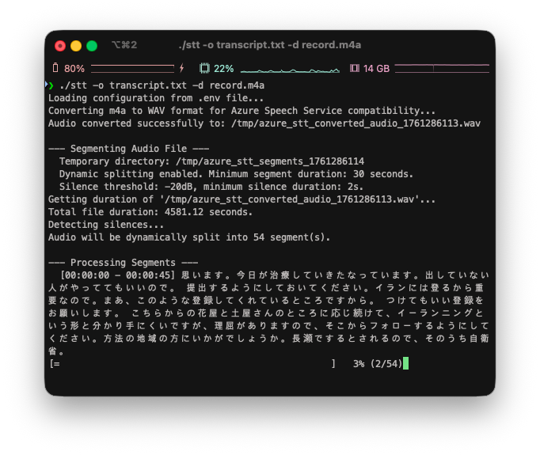

# STT Azure Wrapper

  

A simple wrapper for the Azure Speech-to-Text (STT) service. It provides an easy-to-use interface for converting audio files into text using Azure AI Foundry speech recognition capabilities.

## Getting Started

### Prerequisites
- An Azure AI Foundry access key
- curl
- ffmpeg
- jq

### How to Use

```bash
./stt
```

```
❯ ./stt
Loading configuration from .env file...
Error: No audio file specified.

Usage: ./stt [options] <audio_file_path>
Options:
  -S, --split <seconds>    Segment duration in seconds (default: 30). For dynamic split, this is the minimum segment duration.
  -d, --dynamic-split      Enable dynamic splitting based on silence detection and minimum segment duration.
  -o, --output <file>      Save transcription to file
  -s, --silent             Silent mode (only show progress percentage)
  -v, --verbose            Verbose mode (show detailed segment information)
  -h|--help                Show help message

Example: ./stt -S 300 -o result.txt ./my_audio.wav
         ./stt -d -S 30 -o result.txt ./my_audio.wav
         ./stt -s -o result.txt ./my_audio.wav
         ./stt -v -o result.txt ./my_audio.wav

Or set AUDIO_FILE in .env file
```
